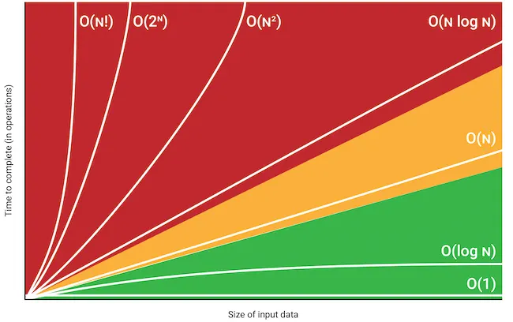

# Time Complexity — Deep Dive (Step 1 in DSA Roadmap)

## 1. What Time Complexity Means

Time complexity measures **how execution time grows with input size (n)**.

Example:
- n = 10  -> program runs 10 steps  
- n = 100 -> program runs 100 steps

Growth rate matters more than actual runtime.

---

## 2. Big-O Notation Table

Big-O describes the **upper bound of algorithm growth**.

| Complexity | Name | Example | n=10 | n=100 |
| :--- | :--- | :--- |:----:| :---: |
| **O(1)** | Constant | Accessing an array element by index |  1   | 1 |
| **O(log n)** | Logarithmic | Binary search |   3  | 7 |
| **O(n)** | Linear | Finding an element in an unsorted array |10 | 100 |
| **O(n log n)** | Linearithmic | Merge Sort, Quick Sort (average case) |30 | 700 |
| **O(n²)** | Quadratic | Bubble Sort, Nested loops |100 | 10,000 |
| **O(2ⁿ)** | Exponential | Recursive Fibonacci (naive) |1,024 | $1.26 \times 10^{30}$ |
| **O(n!)** | Factorial | Generating all permutations of a string | | |   



---

## 3. Code Examples

### O(1) - Constant Time
The execution time does not change regardless of the input size.

**Python:**
```python
def get_first_element(arr):
    return arr[0] if arr else None
```

**Java:**
```java
public static int getFirstElement(int[] arr) {
    if (arr != null && arr.length > 0) return arr[0];
    return -1;
}
```

---

### O(log n) - Logarithmic Time
The input size is reduced by a factor (usually half) in each step.

**Python (Binary Search):**
```python
def binary_search(arr, target):
    low, high = 0, len(arr) - 1
    while low <= high:
        mid = (low + high) // 2
        if arr[mid] == target: return mid
        elif arr[mid] < target: low = mid + 1
        else: high = mid - 1
    return -1
```

**Java:**
```java
    public static int binarySearch(int[] arr, int target) {
        int low = 0, high = arr.length - 1;
        while (low <= high) {
            int mid = low + (high - low) / 2;
            if (arr[mid] == target)
                return mid;
            else if (arr[mid] < target)
                low = mid + 1;
            else
                high = mid - 1;
        }
        return -1;
    }
```

#### Other O(log n) Examples (Not just n/2)
Logarithmic time occurs whenever the problem size is reduced (or multiplied) by a **constant factor** in each step.

**1. Counting Digits (Dividing by 10)**
Each step removes one digit. For a number $N$, there are $\approx \log_{10} N$ digits.

*   **Python:**
    ```python
    def count_digits(n):
        count = 0
        while n > 0:
            n //= 10  # Reduced by factor of 10
            count += 1
        return count
    ```
*   **Java:**
    ```java
    public static int countDigits(int n) {
        int count = 0;
        while (n > 0) {
            n /= 10;
            count++;
        }
        return count;
    }
    ```

**2. Exponentiation by Squaring (Multiplication factor)**
Instead of $O(n)$ multiplying $x$ by itself $n$ times, we square the base and halve the exponent.

*   **Python:**
    ```python
    def power(x, n):
        result = 1
        while n > 0:
            if n % 2 == 1: result *= x
            x *= x  # Squaring the base
            n //= 2 # Halving the exponent
        return result
    ```
*   **Java:**
    ```java
    public static long power(long x, int n) {
        long result = 1;
        int count = 0;
        while (n > 0) {
            if (n % 2 == 1)
                result *= x;
            x *= x;
            n /= 2;
            count++;
        }
        System.out.println("Count: " + count + " Result: " + result);
        return result;
    }
    ```

---

### O(n) - Linear Time
The execution time grows proportionally with the input size.

**Python:**
```python
def find_max(arr):
    max_val = arr[0]
    for num in arr:
        if num > max_val:
            max_val = num
    return max_val
```

**Java:**
```java
public static int findMax(int[] arr) {
    int max = arr[0];
    for (int num : arr) {
        if (num > max) max = num;
    }
    return max;
}
```

---

### O(n log n) - Linearithmic Time
Common in efficient sorting algorithms. It's an $O(n)$ operation performed $\log n$ times.

**Python (Merge Sort):**
```python
# This is O(n log n)
def merge_sort(arr):
    if len(arr) <= 1:
        return arr
    
    mid = len(arr) // 2
    left = merge_sort(arr[:mid])
    right = merge_sort(arr[mid:])
    
    return merge(left, right)
# This is O(n)
def merge(left, right):
    result = []
    i = j = 0
    
    while i < len(left) and j < len(right):
        if left[i] <= right[j]:
            result.append(left[i])
            i += 1
        else:
            result.append(right[j])
            j += 1
            
    result.extend(left[i:])
    result.extend(right[j:])
    return result
```

**Java (Merge Sort):**
```java
    //This is O(n log n)
    public static void mergeSort(int[] arr) {
        if (arr.length < 2)
            return;
        int mid = arr.length / 2;
        int[] left = java.util.Arrays.copyOfRange(arr, 0, mid);
        int[] right = java.util.Arrays.copyOfRange(arr, mid, arr.length);

        mergeSort(left); // log n recursive calls
        mergeSort(right);

        merge(arr, left, right); // O(n) merge process
    }
    //This is O(n)
    private static void merge(int[] arr, int[] left, int[] right) {
        int i = 0, j = 0, k = 0;
        while (i < left.length && j < right.length) {
            if (left[i] <= right[j])
                arr[k++] = left[i++];
            else
                arr[k++] = right[j++];
        }
        while (i < left.length)
            arr[k++] = left[i++];
        while (j < right.length)
            arr[k++] = right[j++];
    }
```

---

### O(n²) - Quadratic Time
The execution time grows with the square of the input size (nested loops).

**Python:**
```python
def print_pairs(arr):
    for i in arr:
        for j in arr:
            print(f"({i}, {j})")
```

**Java:**
```java
public static void printPairs(int[] arr) {
    for (int i : arr) {
        for (int j : arr) {
            System.out.println("(" + i + ", " + j + ")");
        }
    }
}
```

---

### O(2ⁿ) - Exponential Time
The execution time doubles with each addition to the input data set.

**Python (Recursive Fibonacci):**
```python
def fibonacci(n):
    if n <= 1: return n
    return fibonacci(n - 1) + fibonacci(n - 2)
```

**Java:**
```java
public static int fibonacci(int n) {
    if (n <= 1) return n;
    return fibonacci(n - 1) + fibonacci(n - 2);
}
```

---

### O(n!) - Factorial Time
The execution time grows with the factorial of the input size (very slow).

**Python (Permutations):**
```python
def generate_permutations(string, current=""):
    if len(string) == 0:
        print(current)
    for i in range(len(string)):
        remaining = string[:i] + string[i+1:]
        generate_permutations(remaining, current + string[i])
```

---

## 4. Growth Comparison

Fast → Slow

1. **O(1)**
2. **O(log n)**
3. **O(n)**
4. **O(n log n)**
5. **O(n²)**
6. **O(2ⁿ)**
7. **O(n!)**

| Complexity | n=10 | n=100 |
| :--- | :--- | :--- |
| **O(1)** | 1 | 1 |
| **O(log n)** | 3 | 7 |
| **O(n)** | 10 | 100 |
| **O(n log n)** | 30 | 700 |
| **O(n²)** | 100 | 10,000 |
| **O(2ⁿ)** | 1,024 | $1.26 \times 10^{30}$ |


