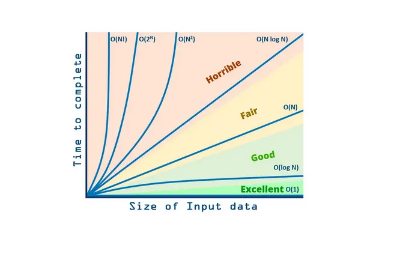

# Time Complexity — Deep Dive (Step 1 in DSA Roadmap)

## 1. What Time Complexity Means

Time complexity measures **how execution time grows with input size (n)**.

Example:

n = 10  -> program runs 10 steps  
n = 100 -> program runs 100 steps

Growth rate matters more than actual runtime.

----------

# 2. Big-O Notation

Big-O describes **upper bound of algorithm growth**.

Common complexities:

| Complexity | Name         | Example               |
| ---------- | ------------ | --------------------- |
| O(1)       | Constant     | Access array element  |
| O(log n)   | Logarithmic  | Binary search         |
| O(n)       | Linear       | Scan array            |
| O(n log n) | Linearithmic | Merge sort            |
| O(n²)      | Quadratic    | Nested loops          |
| O(2ⁿ)      | Exponential  | Brute force recursion |
| O(n!)      | Factorial    | Permutations          |

# 3. Growth Comparison

Fast → Slow

O(1)  
O(log n)  
O(n)  
O(n log n)  
O(n²)  
O(2ⁿ)  
O(n!)

Example when n = 1,000,000
| Complexity | Approx operations |
| ---------- | ----------------- |
| O(1)       | 1                 |
| O(log n)   | ~20               |
| O(n)       | 1,000,000         |
| O(n²)      | 1,000,000,000,000 |

